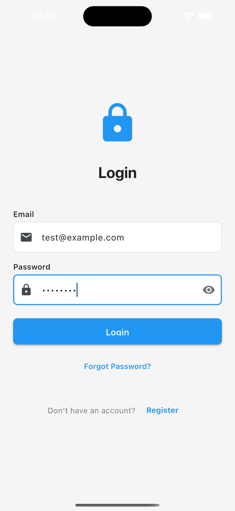
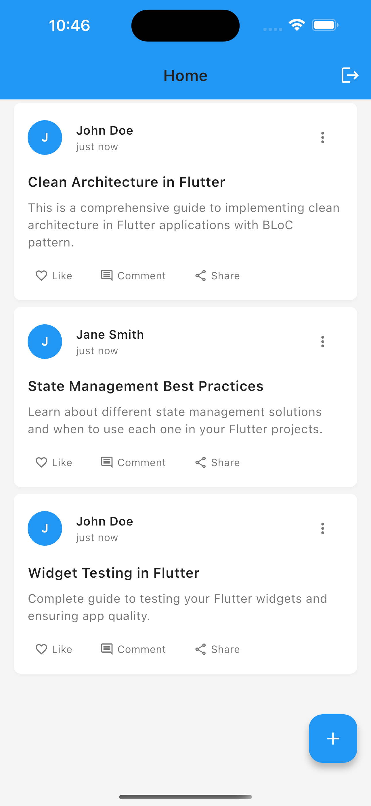

# 🏗️ Clean Architecture Flutter Demo

[](https://flutter.dev)
[](https://dart.dev)
[](https://opensource.org/licenses/MIT)

A comprehensive Flutter application demonstrating **Clean Architecture** principles with **BLoC state management**. This project serves as a complete reference implementation for building scalable, maintainable, and testable Flutter applications.

## 🌟 Features

- ✅ **Clean Architecture** implementation (Domain, Data, Presentation layers)
- ✅ **BLoC Pattern** for state management
- ✅ **Dependency Injection** with GetIt
- ✅ **Repository Pattern** for data access
- ✅ **Model-View-BLoC** architecture
- ✅ **Error Handling** with custom exceptions and failures
- ✅ **Local Storage** with SharedPreferences
- ✅ **HTTP API Integration** (mock implementation)
- ✅ **Form Validation** and input handling
- ✅ **Navigation Management** with custom router
- ✅ **Theme System** (Light/Dark mode support)
- ✅ **Responsive Design** with consistent spacing
- ✅ **Code Documentation** for all files and functions
- ✅ **Extension Methods** for enhanced functionality
- ✅ **Custom Widgets** and reusable components

## 🚀 Demo Credentials

For testing the application, use these dummy login credentials:

```
Email: test@example.com
Password: password
```

**Note**: These are the actual mock credentials hardcoded in the authentication system. Any other credentials will result in an "Invalid credentials" error.

## 📱 Screenshots

<div align="center">
  
  
</div>

<p align="center">
  <em>Login Screen &nbsp;&nbsp;&nbsp;&nbsp;&nbsp;&nbsp;&nbsp;&nbsp;&nbsp;&nbsp;&nbsp;&nbsp;&nbsp;&nbsp;&nbsp;&nbsp;&nbsp;&nbsp;&nbsp;&nbsp; Home Screen</em>
</p>

## 🏛️ Architecture Overview

This project follows **Uncle Bob's Clean Architecture** principles with three distinct layers:

### 🔵 Domain Layer (Business Logic)
- **Entities**: Core business objects
- **Repositories**: Abstract interfaces for data operations
- **Use Cases**: Business logic implementation

### 🟡 Data Layer (Data Access)
- **Models**: Data representations with JSON serialization
- **Repositories**: Concrete implementations of domain interfaces
- **Data Sources**: Remote (API) and Local (Cache) data sources
- **Services**: External service integrations

### 🟢 Presentation Layer (UI)
- **Screens**: UI pages and user interfaces
- **Widgets**: Reusable UI components
- **BLoC**: State management and business logic coordination

### ⚙️ Core Layer (Infrastructure)
- **Constants**: App-wide constants and configuration
- **Utils**: Helper functions and utilities
- **Routes**: Navigation and routing logic
- **Errors**: Exception handling and error management
- **DI**: Dependency injection setup

## 📂 Project Structure

```
lib/
├── 📁 core/                          # Core infrastructure layer
│   ├── 📁 constants/                 # App-wide constants
│   │   ├── app_colors.dart          # Color palette and theming
│   │   ├── app_constants.dart       # App configuration constants
│   │   ├── app_dimensions.dart      # UI spacing and sizing
│   │   ├── app_strings.dart         # Text constants and i18n prep
│   │   ├── app_themes.dart          # Material theme configuration
│   │   └── api_endpoints.dart       # API endpoint definitions
│   ├── 📁 di/                       # Dependency injection
│   │   └── injection_container.dart # GetIt service locator setup
│   ├── 📁 errors/                   # Error handling
│   │   ├── exceptions.dart          # Custom exception classes
│   │   └── failures.dart           # Domain failure classes
│   ├── 📁 helpers/                  # Utility helpers
│   │   └── network_helper.dart     # Network connectivity utilities
│   ├── 📁 routes/                   # Navigation and routing
│   │   ├── app_router.dart          # Route generation and handling
│   │   ├── app_routes.dart          # Route path constants
│   │   └── navigation_service.dart  # Global navigation service
│   └── 📁 utils/                    # Utility functions
│       ├── date_helper.dart         # Date formatting and utilities
│       ├── string_extensions.dart   # String extension methods
│       └── validators.dart          # Form validation utilities
├── 📁 data/                         # Data access layer
│   ├── 📁 datasources/             # Data source abstractions
│   │   ├── local_data_source.dart   # Local storage interface/impl
│   │   └── remote_data_source.dart  # API data source interface/impl
│   ├── 📁 models/                   # Data models with JSON serialization
│   │   ├── api_response_model.dart  # Generic API response wrapper
│   │   ├── post_model.dart          # Post data model
│   │   └── user_model.dart          # User data model
│   ├── 📁 repositories/             # Repository implementations
│   │   └── user_repository_impl.dart # User repository concrete impl
│   └── 📁 services/                 # External service integrations
│       ├── api_service.dart         # HTTP API service
│       ├── local_storage_service.dart # Local storage service
│       └── notification_service.dart # Push notification service
├── 📁 domain/                       # Business logic layer
│   ├── 📁 entities/                 # Core business entities
│   │   ├── post_entity.dart         # Post business entity
│   │   └── user_entity.dart         # User business entity
│   └── 📁 repositories/             # Repository interfaces
│       ├── post_repository.dart     # Post repository interface
│       └── user_repository.dart     # User repository interface
├── 📁 presentation/                 # UI and state management layer
│   ├── 📁 bloc/                     # BLoC state management
│   │   ├── 📁 auth/                 # Authentication BLoC
│   │   │   ├── auth_bloc.dart       # Auth business logic
│   │   │   ├── auth_event.dart      # Auth events
│   │   │   └── auth_state.dart      # Auth states
│   │   └── 📁 posts/                # Posts BLoC
│   │       ├── posts_bloc.dart      # Posts business logic
│   │       ├── posts_event.dart     # Posts events
│   │       └── posts_state.dart     # Posts states
│   ├── 📁 screens/                  # Application screens
│   │   ├── 📁 auth/                 # Authentication screens
│   │   │   ├── login_screen.dart    # Login interface
│   │   │   └── 📁 widgets/          # Auth-specific widgets
│   │   │       └── login_form.dart  # Login form component
│   │   ├── 📁 home/                 # Home screen
│   │   │   ├── home_screen.dart     # Main dashboard
│   │   │   └── 📁 widgets/          # Home-specific widgets
│   │   │       └── user_info_card.dart # User info component
│   │   ├── 📁 posts/                # Posts screens
│   │   │   ├── posts_screen.dart    # Posts list screen
│   │   │   └── 📁 widgets/          # Posts-specific widgets
│   │   │       ├── post_card.dart   # Post display card
│   │   │       └── post_item.dart   # Post list item
│   │   ├── 📁 profile/              # Profile screens
│   │   │   └── profile_screen.dart  # User profile interface
│   │   └── 📁 splash/               # Splash screen
│   │       └── splash_screen.dart   # App initialization screen
│   └── 📁 widgets/                  # Reusable UI components
│       └── 📁 common/               # Common widgets
│           ├── custom_app_bar.dart  # Reusable app bar
│           ├── custom_button.dart   # Styled button component
│           ├── custom_text_field.dart # Styled input field
│           ├── error_widget.dart    # Error display component
│           ├── loading_widget.dart  # Loading indicators
│           └── skeleton_loader.dart # Skeleton loading animation
├── main.dart                        # Application entry point
└── 📁 test/                         # Test files
    └── widget_test.dart            # Widget testing suite
```

## 🛠️ Getting Started

### Prerequisites

- Flutter SDK (3.0.0 or higher)
- Dart SDK (2.17.0 or higher)
- Android Studio / VS Code with Flutter extensions
- Git

### Installation

1. **Clone the repository**
   ```bash
   git clone https://github.com/CodeBlood004/clean_architecture.git
   cd clean_architecture
   ```

2. **Install dependencies**
   ```bash
   flutter pub get
   ```

3. **Run the application**
   ```bash
   flutter run
   ```

### Development Setup

1. **Install recommended VS Code extensions:**
   - Flutter
   - Dart
   - Bloc
   - GitLens

2. **Configure your IDE:**
   - Enable Dart formatting on save
   - Set up Flutter snippets
   - Configure debugging breakpoints

## 🔧 Configuration

### Environment Setup

The app is currently configured with mock data and services. To integrate with real APIs:

1. **Update API endpoints** in `/lib/core/constants/api_endpoints.dart`
2. **Configure real HTTP client** in `/lib/data/services/api_service.dart`
3. **Update data sources** in `/lib/data/datasources/remote_data_source.dart`
4. **Add environment variables** for different build configurations

### Theme Customization

Customize the app's appearance by modifying:
- **Colors**: `/lib/core/constants/app_colors.dart`
- **Spacing**: `/lib/core/constants/app_dimensions.dart`
- **Themes**: `/lib/core/constants/app_themes.dart`
- **Text**: `/lib/core/constants/app_strings.dart`

## 🧪 Testing

### Running Tests

```bash
# Run all tests
flutter test

# Run tests with coverage
flutter test --coverage

# Run integration tests
flutter test integration_test/
```

### Test Structure

- **Unit Tests**: Business logic testing
- **Widget Tests**: UI component testing
- **Integration Tests**: End-to-end flow testing

## 📚 Key Learning Points

This project demonstrates:

### 🎯 Clean Architecture Benefits
- **Separation of Concerns**: Each layer has distinct responsibilities
- **Dependency Inversion**: High-level modules don't depend on low-level modules
- **Testability**: Easy to unit test business logic in isolation
- **Maintainability**: Changes in one layer don't affect others
- **Scalability**: Easy to add new features and modify existing ones

### 🔄 BLoC Pattern Implementation
- **Event-Driven Architecture**: UI triggers events, BLoC processes them
- **State Management**: Predictable state changes and updates
- **Business Logic Separation**: UI is purely reactive to state changes
- **Testing**: Easy to test business logic with mock events and states

### 🏗️ Repository Pattern
- **Data Abstraction**: Domain layer doesn't know about data sources
- **Multiple Data Sources**: Seamless switching between remote/local data
- **Caching Strategy**: Offline-first approach with proper fallbacks
- **Error Handling**: Consistent error management across data operations

## 🤝 Contributing

Contributions are welcome! Please feel free to submit a Pull Request. For major changes:

1. Fork the repository
2. Create your feature branch (`git checkout -b feature/AmazingFeature`)
3. Commit your changes (`git commit -m 'Add some AmazingFeature'`)
4. Push to the branch (`git push origin feature/AmazingFeature`)
5. Open a Pull Request

### Contribution Guidelines

- Follow the existing code style and architecture patterns
- Add appropriate documentation for new features
- Include tests for new functionality
- Update README if necessary

## 📄 License

This project is licensed under the MIT License - see the [LICENSE](LICENSE) file for details.

## 👨‍💻 Author

**CodeBlood004**
- GitHub: [@CodeBlood004](https://github.com/CodeBlood004)

## 🙏 Acknowledgments

- [Flutter Team](https://flutter.dev) for the amazing framework
- [BLoC Library](https://bloclibrary.dev) for state management
- [Clean Architecture](https://blog.cleancoder.com/uncle-bob/2012/08/13/the-clean-architecture.html) by Uncle Bob
- [GetIt](https://pub.dev/packages/get_it) for dependency injection

## 📈 Project Stats

- **Language**: Dart
- **Framework**: Flutter
- **Architecture**: Clean Architecture + BLoC
- **State Management**: BLoC Pattern
- **Dependency Injection**: GetIt
- **Testing**: Widget & Unit Tests
- **Documentation**: Comprehensive inline docs

---

⭐ **If you found this project helpful, please consider giving it a star!** ⭐

This project serves as a complete reference for implementing Clean Architecture in Flutter applications. Feel free to use it as a starting point for your own projects or as a learning resource.